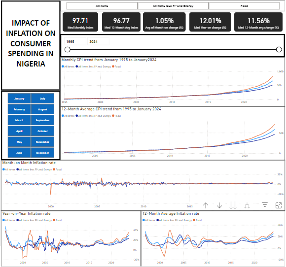

 # Impact of Inflation on Consumer Spending in Nigeria

This is my entry for the Data Analytics Competition by Cortouch Media, where I analysed consumer price index dataset spanning from Janauary 1995 to January 2024 to generate data-driven insights.

You can download or view the presentation https://drive.google.com/file/d/18KoEglaMf_P90eykYIntx5KF7pXRvw_O/view?usp=sharing

You can interact with the PowerBI report [here](https://app.powerbi.com/view?r=eyJrIjoiZWY0MTNiNjQtN2NkMS00YTY2LTk5MTktZjQ2MTAzNDQxOWZiIiwidCI6IjA4ZTY2OWIxLTQxOTktNDM4YS1hNjMxLTFiYWI3NWRhN2Y0MiJ9)

# Definitions
### Consumer Price Index 
The Consumer Price Index (CPI) measures the average change over time in the prices consumers pay for a representative basket of consumer goods and services. The CPI is a measure of and reflects inflation as experienced by consumers in their day-to-day living expenses. It is also known as the headline CPI. 

            CPI = ( Value of Basket in Current Year / Value of Basket in Base year ) x 100

### Inflation
Inflation is a gradual loss of purchasing power that is reflected in a broad rise in prices for goods and services over time. It allows for a single-value representation of the increase in the price level of goods and services in an economy over a specified time.

            Inflation rate = ( Current CPI – Old CPI / Old CPI ) x 100

You can read more about this [here](https://www.investopedia.com/terms/c/consumerpriceindex.asp).

# The dataset

The dataset was provided by Cortouch Media.

It contains 17 columns and about 350 rows.

It contained the Consumer Price Index and Inflation rate for 3 categories of goods and services (All items, Food, and Core-CPI - All items less Farm produce and Energy) from January 1995 to January 2024.

# The Objective

To Analyze the Impact of Inflation on Consumer Spending in Nigeria

# Key Questions

- How has the CPI changed over time?
- How does the monthly inflation trend compare to the yearly inflation trend?
- How does the current inflation rate compare to previous rates?

# Tools used & Skills demonstrated in this project

- Microsoft Excel: Data cleaning
- Power BI: Data transformation and Visualization

# Visualization

You can read the details of the report [here](https://drive.google.com/file/d/18KoEglaMf_P90eykYIntx5KF7pXRvw_O/view?usp=sharing) and can also interact with the PowerBI report [here](https://app.powerbi.com/view?r=eyJrIjoiZWY0MTNiNjQtN2NkMS00YTY2LTk5MTktZjQ2MTAzNDQxOWZiIiwidCI6IjA4ZTY2OWIxLTQxOTktNDM4YS1hNjMxLTFiYWI3NWRhN2Y0MiJ9).

# Summary of findings

- Both monthly and 12-month average CPIs have a generally increasing trend. Although there are occasional periods where CPI decreases. 
- The price of all items went up by 1.12% on average on a monthly basis, 0.94% for core items and 1.09% for food. The current rates are 2.64%, 2.24% and 3.21% respectively.
- On a yearly basis, average inflation for all items was 12.63%, 11.11% for core items, and food price went up by 13.05%. This is currently at 29.90%, 23.59%, and 35.41%.
- The 12-month average inflation for all items was 12.38%, 10.84% for core items, and 14.05% for food. This is currently at 25.35%, 21.15%, and 28.91% respectively.

## Connect with me

- [email](mailto:dolanrewaju231194@gmail.com)
- [LinkedIn](http://www.linkedin.com/in/damilola-olanrewaju-0478371a3)

