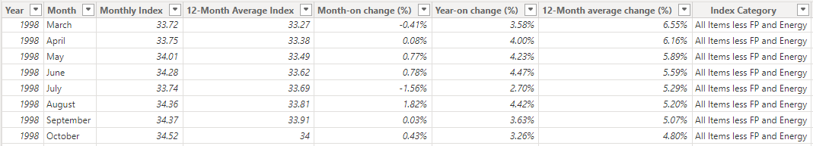

# Impact of Inflation on Consumer Spending in Nigeria

This is my entry for the Data Analytics Competition by Cortouch Media, where I analysed consumer price index dataset spanning from Janauary 1995 to January 2024 to generate data-driven insights.

You can download or view the presentation [here](https://drive.google.com/file/d/18KoEglaMf_P90eykYIntx5KF7pXRvw_O/view?usp=sharing)

You can interact with the PowerBI report [here](https://app.powerbi.com/view?r=eyJrIjoiZWY0MTNiNjQtN2NkMS00YTY2LTk5MTktZjQ2MTAzNDQxOWZiIiwidCI6IjA4ZTY2OWIxLTQxOTktNDM4YS1hNjMxLTFiYWI3NWRhN2Y0MiJ9)

# Introduction

## The dataset

